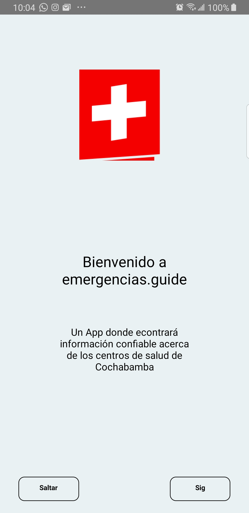
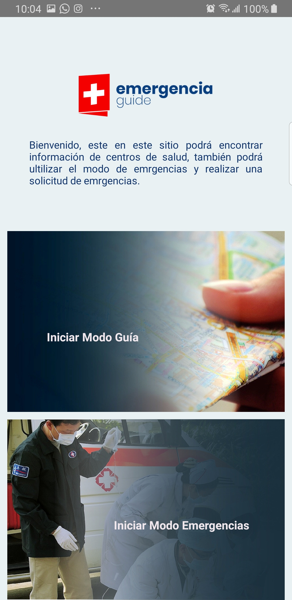
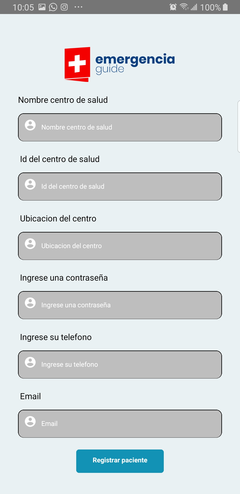

# Guia de emergencias y centros de salud




_Con esta app, podrá encontrar información actualizada y confiable de los centros de salud y enviar solicitudes de emergencias a los centros de salud cercanos a UD. _

## Comenzando 🚀


_Estas instrucciones te permitirán obtener una copia del proyecto en funcionamiento en tu máquina local para propósitos de desarrollo y pruebas._

Lee **Atentamente** para conocer cómo utilizar la App.


### Pre-requisitos 📋

_Primero que nada necesitamos saber que se usan los siguientes recursos:_
* [Node.js](https://nodejs.org/es/download/) - El servidor que se necesita instalar en la PC.
* [react-native](https://www.npmjs.com/package/react-native) - El framework que vamos a utilizar.
* Un editor de código para editar nuestro código, este editor puede ser el que tú quieras, algunas ideeas pueden ser:[Atom](https://atom.io/),[Visual Code](https://code.visualstudio.com/download),[Sublime](https://www.sublimetext.com/3).
* Google Maps API
* FIREBASE
* MySQL
Una vez instalados y configurados Iniciamos un nuevo proyecto, escribimos en nuestra consola:
```
npx react-native init NOMBRE_DE_TU_PROYECTO
```
Ahora ya que tenemos eso listo, podemos continuar la instalación de la App.

### Instalación 🔧

_Ahora ya que tenemos un nuevo Proyecto con REAC-NATIVE podemos instalar las dependencias de la app, para eso nos situamos con nuestra consola dentro de la app y ejecutamos:_

```
npm install
```

_Una vez termine de descargar la libreria, podemos emepeazr a Utilizarla._


_Ahora ya tenemos la App todo listo para su uso, pero nos toca configuar nuestro dispositivo android:_

### Si no cuentas con un dispositivo android puedes utilizar:

[Expo](https://expo.io/) - Expo es una cadena de herramientas construida alrededor de React Native para ayudarlo a iniciar rápidamente una aplicación, siguiendo las instrucciones que se encuentra en la documentación de su página web.

## Si tienes un dispositivo android puedes seguir con estos pasos
## Configuración del dispositivo android ⚙️

* Esto depende mucho de la marca del dispositivo.
* Lo usual es ir a configuracion del sipositivo.
* Buscar y encender la opción: **Depuración por USB**.


_AHORA CONECTAMOS NUESTRO DISPOSITIVO A NUENTRO ORDENADOR VIA USB_

* Y ejecutamos el siguiente comando para iniciar el proyecto en nuestro dispositivo.
```
npx react-native run-android
```

## Ahora veamos la funcionalidad
### Inicio
Para conseguir el inicio que se vé, 2 onboardings con la presentacion del proyecto, se utilizó una librería que fue elaborada por mi persona, esta librería fue subida a https://npmjs.com y está disponible para su descarga con el comando:
```
npm install --save examen_hito4
```

Este onboard tiene la funcionalidad de presentar un resumen muy corto hacerca del sistema, presionando los botones de la parte inferior se puede Saltar esta sección o verla completa, para luego poder ingresal al login de la App:

Si yá estas registrado en la Aplicación entonces puedes inicar sesión con tu Email y Pass registrados previamente, en caso de que no esté registrado entonces puedes ingresar a la seccion de registro, presionando el botton registrarse.
## Autor ✒️

* **Isaac Limbert Herrera Mareño** - *Desarrollo de la App* - [Guit Isaac0155](https://github.com/Isaac0155)
* **William Barra** - *Docente guía para el desarrollo* - [Guit dheeyi](https://github.com/dheeyi)

## Licencia 📄

Este proyecto está bajo la Licencia MIT - mira el archivo [LICENSE.md](LICENSE.md) para más detalles.
